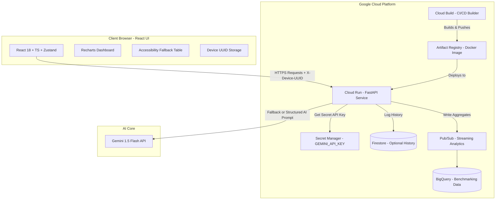

# CarbonCoach

CarbonCoach is an AI-powered carbon footprint assistant tailored for the "urban daily commuter." It allows commuters to track their daily carbon impact, simulate "what-if" scenarios, view a structured 90-day reduction roadmap, and receive personalized coaching insights powered by Gemini (with a robust deterministic fallback).

## Features
- **Understand**: Learn how commuter activities (transit modes, diet, work setups) impact carbon footprints.
- **Track**: Log metrics securely using a randomly generated client UUID (No PII).
- **Reduce**:
  - **What-If Simulator**: Real-time modeling of habits swaps.
  - **90-Day Roadmap**: Day-by-day tasks grouped in milestones (Easy -> Medium -> Advanced).
  - **"Show the Math"**: Complete math explainability for transparency.
  - **Gemini Insights**: Personalized AI coaching recommendations with a rule-based fallback.

---

## System Architecture



---

## Directory Structure
- `backend/app/`: FastAPI application code.
  - `carbon_engine/`: Pure python logic for math emissions.
  - `insight_engine/`: Prompt execution and deterministic fallback logic.
  - `tests/`: Pytest tests.
- `frontend/`: Vite + React + TypeScript web app.
  - `src/components/`: Accessible UI elements (WCAG 2.1 AA).

---

## Local Setup

### Backend (FastAPI)
1. Navigate to `/backend` directory.
2. Install dependencies:
   ```bash
   pip install -r requirements.txt
   ```
3. Run FastAPI:
   ```bash
   uvicorn app.main:app --reload
   ```

### Frontend (React + Vite)
1. Navigate to `/frontend` directory.
2. Install dependencies:
   ```bash
   npm install
   ```
3. Run the development server:
   ```bash
   npm run dev
   ```
4. Access the UI at `http://localhost:5173`.

---

## Netlify Frontend Deploy

This repository includes `netlify.toml` for deploying the Vite frontend from the
`frontend/` subdirectory:

- Base directory: `frontend`
- Build command: `npm run build`
- Publish directory: `frontend/dist`

Netlify only hosts the static React frontend. Deploy the FastAPI backend
separately, for example with the included Dockerfile on Cloud Run, then set this
Netlify environment variable:

```bash
VITE_API_BASE_URL=https://your-backend.example.com/api
```

If `VITE_API_BASE_URL` is not set, the frontend defaults to `/api`, which is only
appropriate when the frontend and FastAPI backend are served from the same origin
or when Vite's local dev proxy is running.
