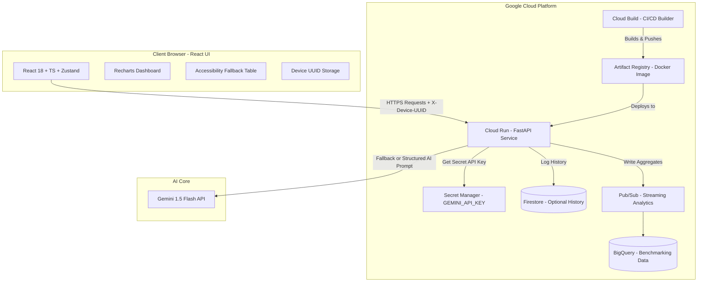

# CarbonCoach

CarbonCoach is an AI-powered carbon footprint assistant tailored for the "urban daily commuter." It allows commuters to track their daily carbon impact, simulate "what-if" scenarios, view a structured 90-day reduction roadmap, and receive personalized coaching insights powered by Gemini (with a robust deterministic fallback).

## Features
- **Understand**: Learn how commuter activities (transit modes, diet, work setups) impact carbon footprints.
- **Track**: Log metrics securely using a randomly generated client UUID (No PII).
- **Reduce**:
  - **What-If Simulator**: Real-time modeling of habits swaps.
  - **90-Day Roadmap**: Day-by-day tasks grouped in milestones (Easy -> Medium -> Advanced).
  - **"Show the Math"**: Complete math explainability for transparency.
  - **Gemini Insights**: Personalized AI coaching recommendations with a rule-based fallback.

---

## System Architecture



---

## Directory Structure
- `backend/app/`: FastAPI application code.
  - `carbon_engine/`: Pure python logic for math emissions.
  - `insight_engine/`: Prompt execution and deterministic fallback logic.
  - `tests/`: Pytest tests.
- `frontend/`: Vite + React + TypeScript web app.
  - `src/components/`: Accessible UI elements (WCAG 2.1 AA).

---

## Local Setup

### Backend (FastAPI)
1. Navigate to `/backend` directory.
2. Install dependencies:
   ```bash
   pip install -r requirements.txt
   ```
3. Run FastAPI:
   ```bash
   uvicorn app.main:app --reload
   ```

### Frontend (React + Vite)
1. Navigate to `/frontend` directory.
2. Install dependencies:
   ```bash
   npm install
   ```
3. Run the development server:
   ```bash
   npm run dev
   ```
4. Access the UI at `http://localhost:5173`.

---

## Recommended Deploy: Cloud Run

For the hackathon demo, deploy CarbonCoach as one Cloud Run service. The
Dockerfile builds the React frontend and serves it from FastAPI, so the deployed
app has both UI and API on the same origin.

0. Install and initialize the Google Cloud CLI:
   - Install the Google Cloud CLI from Google's installer.
   - Open a new PowerShell window after installation so `gcloud` is on `PATH`.
   - Run:
     ```bash
     gcloud init
     gcloud config set project YOUR_PROJECT_ID
     ```

1. Enable the required Google Cloud APIs:
   ```bash
   gcloud services enable run.googleapis.com cloudbuild.googleapis.com artifactregistry.googleapis.com
   ```

2. Submit the Cloud Build:
   ```bash
   gcloud builds submit --config cloudbuild.yaml .
   ```

3. After the build finishes, open the Cloud Run service URL for `carboncoach`.

The default deployment does not require a Gemini API key. If `GEMINI_API_KEY` is
missing, the backend uses deterministic fallback insights.

### Optional Gemini Secret

Only do this if you want live Gemini insights in the demo:

```bash
gcloud secrets create GEMINI_API_KEY --replication-policy=automatic
gcloud secrets versions add GEMINI_API_KEY --data-file=-
gcloud run services update carboncoach \
  --region us-central1 \
  --set-secrets GEMINI_API_KEY=GEMINI_API_KEY:latest
```

If the first Cloud Build step cannot create the Artifact Registry repository,
create it once manually:

```bash
gcloud artifacts repositories create carboncoach \
  --repository-format=docker \
  --location=us \
  --description="CarbonCoach container images"
```

---

## Netlify Frontend Deploy

This repository includes `netlify.toml` for deploying the Vite frontend from the
`frontend/` subdirectory:

- Base directory: `frontend`
- Build command: `npm run build`
- Publish directory: `frontend/dist`

Netlify only hosts the static React frontend. Deploy the FastAPI backend
separately, for example with the included Dockerfile on Cloud Run, then set this
Netlify environment variable:

```bash
VITE_API_BASE_URL=https://your-backend.example.com/api
```

If `VITE_API_BASE_URL` is not set, the frontend defaults to `/api`, which is only
appropriate when the frontend and FastAPI backend are served from the same origin
or when Vite's local dev proxy is running.

---

## No Google Billing Backend: Render

If Google Cloud billing blocks your hackathon deploy, host the FastAPI backend on
Render and keep the frontend on Netlify.

1. Push this repository to GitHub.
2. In Render, create a new **Blueprint** from the repository. Render will read
   `render.yaml` and create the `carboncoach-api` web service.
3. After the Render service is live, copy its URL, for example:
   ```bash
   https://carboncoach-api.onrender.com
   ```
4. In the Render service environment variables, set:
   ```bash
   CORS_ORIGINS=https://YOUR-NETLIFY-SITE.netlify.app
   ```
   This is a custom environment variable. In Render, open the service,
   go to **Environment**, click **Edit**, add a new key named
   `CORS_ORIGINS`, and paste your Netlify URL as the value.
5. In Netlify environment variables, set:
   ```bash
   VITE_API_BASE_URL=https://carboncoach-api.onrender.com/api
   ```
6. Redeploy Netlify after setting `VITE_API_BASE_URL`.

`GEMINI_API_KEY` is optional on Render. If you do not set it, CarbonCoach uses
deterministic fallback insights.

Manual Render settings if you do not use the Blueprint:

- Root directory: `backend`
- Build command: `pip install -r requirements.txt`
- Start command: `uvicorn app.main:app --host 0.0.0.0 --port $PORT`
- Runtime: Python 3.11
